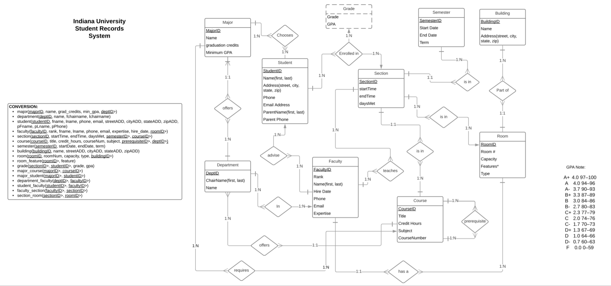

# MYSQL Database with Basic PHP Connection to Demo Advanced Queries

Custom built MySQL University Record System Database and Basic PHP with advanced queries against the database populated with mock data for illustration purposes.

Working URL hosted by the School of Informatics and Computing at Indiana University:
http://cgi.soic.indiana.edu/~ddvu/final/home.php

Customized Entity Relationship Diagram is as follows gathered from client specifications:
